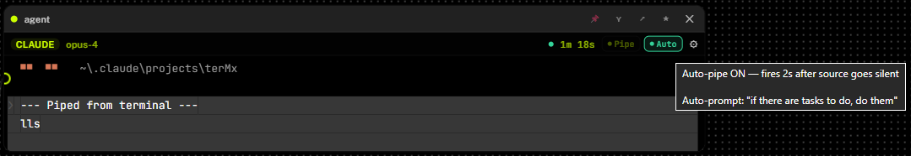

# Wiring Tiles Together

> Connect tiles on the canvas so data flows between them automatically. This is the feature that makes TerminalX different from a regular terminal — you build agent pipelines once, then let them run.

**Total time to learn:** 2 minutes.

---

## Quick start (60 seconds)

1. Open TerminalX and click **Layout** in the top bar — this spawns a default workspace with Terminal, Agent, Files, Tasks, and Git tiles.
2. **Hover** over the Terminal tile — a small glowing circle appears on its **right edge**.
3. **Click and drag** from that circle — a dashed line follows your cursor.
4. **Drop** on the Agent tile's **left edge** — the line snaps in place.
5. Done. The Terminal is now wired to the Agent. Anything that happens in the Terminal will be piped to the Agent as context when the Agent completes its next task.


---

## The interaction — step by step

### On macOS and Windows (identical)

| Step | What to do | What you'll see |
|------|-----------|-----------------|
| 1 | Hover any tile | A small accent-colored circle appears on the **right edge** (output) and **left edge** (input) |
| 2 | Press mouse down on the **right edge circle** | A dashed line starts following your cursor |
| 3 | Drag your cursor to another tile | The line stretches with you as you move |
| 4 | Release over the other tile's **left edge circle** | The other tile's circle lights up, then the wire locks in place |
| 5 | Release anywhere else | Wire is cancelled, nothing happens |

### Keyboard

- **Esc** — cancel an in-progress drag at any time (either platform)

### Removing a wire

**Right-click** on any wire (the 12px hit area around the line is invisible but clickable). A confirmation dialog appears → click OK.

- **macOS trackpad:** two-finger tap on the wire
- **Windows:** right-click
- **Linux:** right-click

---

## The 5 wire types

TerminalX picks the right wire type automatically based on what you connect. You don't configure it — just drag.

### 1. context-pipe

**What you wire:** Terminal → Agent (or Runner → Agent)

**What it does:** Accumulates terminal output into a buffer, then lets you inject it into the agent as context. Two modes — **manual** (you click Pipe when ready) and **auto** (pipes automatically after source silence).

When an agent has an incoming `context-pipe` wire, two new buttons appear in its header:

```
Status dot    Elapsed    ┌──────────┐  ┌────────┐   Config
     ●       3m 12s      │ ● Pipe   │  │ ● Auto │    ⚙
                         │   (142)  │  │        │
                         └──────────┘  └────────┘
```

**Everything you can do:**

| Control | Action | Result |
|---------|--------|--------|
| **Pipe button** — left-click | Manually inject buffered output | Piped + toast `"Piped N chars"` |
| **Pipe button** — right-click | Pipe **full history** (including pre-wire buffer) | Resets offset to 0, sends everything |
| **Pipe button** — hover | Tooltip shows exact byte count + source count | `"Click to pipe 142 bytes from 1 tile"` |
| **Auto toggle** — left-click | Turn hands-free auto-pipe on/off | Green glow + green dot when ON |
| **Auto toggle** — right-click | Edit the auto-prompt that gets sent after piping | Dialog with example prompts |
| **Auto toggle** — hover when ON | Tooltip shows current prompt preview | `"Auto-pipe ON — Auto-prompt: 'Analyze...'"` |

**Visual states of the Pipe button:**

| State | Appearance | Meaning |
|-------|-----------|---------|
| No unread data | Dim grey outline, no glow | Nothing new to pipe — button is disabled |
| Unread data available | Accent border + pulsing glow + byte count | Click to pipe; button gently pulses every 2s |
| Auto is ON | Label stays **"Pipe"** (Auto indicator is the separate green toggle) | — |

**Manual mode — the standard flow:**

1. Wire Terminal → Claude agent
2. Run `npm test` in the terminal
3. Test output scrolls, Pipe button lights up: `● Pipe (1.2k)`
4. Click the Pipe button → context injected into Claude
5. Type into Claude: *"Fix the failing tests above"*
6. Claude reads your prompt + the `--- Piped from terminal ---` block and starts fixing

**Hands-free mode (auto-pipe):**

The Auto toggle (the second button, next to Pipe) turns on full automation. When enabled:

- TerminalX watches the source tile's output buffer
- When output has been **silent for 2 seconds** (configurable), it auto-pipes the accumulated text
- If you've configured an **auto-prompt**, it's appended after the piped context and sent to the agent with `Enter` — so the agent starts responding immediately
- A toast confirms: `"Auto-piped 142 chars + prompt"`

**Two-step hands-free setup:**

1. **Right-click the Auto toggle** → dialog opens:
   > *"What should the agent do after auto-pipe? (leave blank = pipe silently)"*
   
   Type something like `"Analyze the output above and explain what happened."` → OK
2. **Click the Auto toggle** → it glows green → hands-free mode is live



*Hovering the green Auto toggle shows the current state + your configured prompt — useful for verifying the agent is set up correctly before you walk away.*

From now on, every command you run in the connected terminal will be piped to the agent with your prompt, automatically. Close the loop and walk away.

**Example auto-prompts:**

| Prompt | Use case |
|--------|----------|
| `"Analyze the output above and explain what happened."` | Live log monitoring / debugging |
| `"If there are errors, suggest fixes."` | Test-driven development |
| `"Summarize in one sentence."` | High-level overview of long outputs |
| `"What's the next step based on this?"` | Continuous workflow guidance |
| *(empty)* | Pipe silently — context loaded, no response until you prompt manually |

**Why the 2-second delay?**

Piping every keystroke would spam the agent with partial output mid-command. Waiting for 2 seconds of silence catches the natural "command finished, shell returned to prompt" state. It's enough time for most commands to fully complete their output.

> **Adjusting the idle timer:** Press `Ctrl+K` / `⌘K` → search **"Set Agent Idle Threshold"** → enter a value in seconds (1-300). Lower = snappier, higher = waits longer for slow commands.

**Safety caps on what gets piped:**

- **Only new output** — content that existed before the wire was created is ignored (no dumping the PowerShell welcome banner)
- **Max 50 lines** per pipe — even if the terminal has 10,000 lines, only the last 50 get sent
- **ANSI escape codes stripped** — no `\x1b[...]` junk reaches the agent
- **Control chars removed** — keeps output clean and readable

---

### 2. agent-chain

**What you wire:** Agent A → Agent B

**What it does:** When Agent A completes, its entire output gets fed into Agent B as context. Agent B sees `--- Context from previous agent (A's name) ---` followed by A's final 50 lines.

**Example — design → build pipeline:**

1. Wire **Claude (opus-4)** → **Codex**
2. Prompt Claude: *"Design a REST API for a todo app. When complete, output DONE on a new line."*
3. Claude responds with the schema → outputs DONE → wire fires.
4. Codex receives Claude's full response → you tell Codex *"Implement the API above in TypeScript/Express."*

---

### 3. refresh-trigger

**What you wire:** Agent → Browser

**What it does:** When the agent completes, the browser tile gets a "refresh" signal (shown as a toast). Useful if you're coding a local web app and want to see changes after the agent makes them.

**Example:** Wire Claude → Browser tile pointing at `localhost:3000`. Agent edits a React file → finishes → browser tile knows to refresh (either manually click refresh or set HMR up in your dev server).

---

### 4. task-assign

**What you wire:** Agent → Tasks (Todo tile)

**What it does:** The agent's last output line becomes a new task in the todo list, tagged with the agent's name.

**Example prompt:**
> "Audit this codebase and list follow-up work. Every bullet you output will become a task — keep them concise and action-oriented."

---

### 5. diff-feed

**What you wire:** Agent → Diff

**What it does:** When the agent completes, the diff tile receives a refresh signal. Pair this with a diff tile pointed at a specific file you care about.

---

## Agent tile — full button reference

All the controls that appear on an agent tile's header, in left-to-right order:

| Element | Purpose | Left-click | Right-click | Hover tooltip |
|---------|---------|-----------|-------------|---------------|
| 🟢 **Status dot** | Agent state (spawning / working / done / error / idle) | — | — | — |
| **Elapsed** | Running time since spawn | — | — | — |
| **Pipe (N)** | Inject buffered source context | Pipe new bytes only | Pipe full history | Byte count + source count |
| **Auto** | Hands-free auto-pipe toggle | Toggle on/off | Edit auto-prompt | Current state + prompt preview |
| ⚙ **Config gear** | Set custom CLI command | Open config panel | — | — |
| ✕ **Close** | Remove the agent tile | Close tile | — | — |

Only the **Pipe** and **Auto** buttons appear when an incoming `context-pipe` wire exists. The rest are always there.

---

## Bonus: Auto-recovery (Runner → Agent)

This is the most underrated pattern.

1. Spawn a **Runner** tile with command `npm test` (or `cargo test`, `pytest`, whatever)
2. Spawn a **Claude** agent
3. Wire Runner → Agent
4. Hit **Run** on the runner

If the tests **pass**, nothing happens. If they **fail**, the error output is auto-dispatched to Claude with a prompt asking to fix it. Claude reads the error, patches the code, you re-run. No manual copy-paste.

---

## The DONE signal — making agent-chain reliable

Agent CLIs (Claude, Codex, Gemini) stay running after each response. They don't exit. TerminalX needs some way to know "this agent is done with the current task" so the wire can fire.

Two ways to signal done:

### 1. Explicit DONE sentinel (recommended)

End every agent prompt with an instruction like:

> "When complete, output DONE on a new line."

The word `DONE` on its own line (case-insensitive) flips the agent's status to done → fires the wire → next agent picks up.

**Accepted forms:**
- `DONE`
- `done`
- `Done`
- `✅ DONE`
- `✓ DONE`
- `[DONE]`
- `## DONE`
- `DONE.`
- `DONE!`

**Won't false-trigger on:**
- `DONEness`
- `DONE-STATE`
- `"DONE" mentioned mid-sentence`

### 2. Idle timeout (automatic fallback)

If you forget to ask for DONE, the agent still auto-completes after **8 seconds of silence** (configurable). Safeguards prevent this from firing on welcome banners or short status lines.

**To change the idle timeout:**

Press **Ctrl+K** (or **⌘K** on macOS) → type `idle` → select **"Set Agent Idle Threshold"** → enter the number of seconds.

**To disable auto-complete entirely for an agent:**

Ctrl+K / ⌘K → search **"Toggle Agent Auto-Complete"** with the agent tile focused.

### Visual confirmation

When the wire fires, you'll see a grey marker in the terminal:

```
[auto-complete: DONE sentinel detected]
```

or

```
[auto-complete: idle > 8s]
```

This tells you exactly why the wire triggered.

---

## Real-world workflows

### Multi-agent code review

```
┌──────────┐       ┌──────────┐       ┌──────────┐
│ Codex    │──────▶│ Claude   │──────▶│ Diff     │
│ (writer) │       │ (review) │       │ (output) │
└──────────┘       └──────────┘       └──────────┘
```

1. Give Codex a coding task → outputs code + DONE.
2. Wire fires → Claude gets Codex's code + your prompt "Review this for bugs, security, and style. Output DONE when finished."
3. Wire fires → Diff tile refreshes with whatever file the agents touched.

### Slack-driven autopilot

```
Slack #tasks  →  Todo tile  →  Claude agent  →  Git tile
                  (auto-dispatch)   (auto-complete)
```

1. Connect Slack MCP in Tasks tile (click MCP tab).
2. Toggle **Auto** dispatch on.
3. Wire Claude → Git tile.
4. Drop a task in Slack: *"Add dark mode toggle. Output DONE when complete."*
5. Tasks tile syncs every 5 min → picks up your message → auto-dispatches to Claude.
6. Claude implements → outputs DONE → Git tile refreshes showing the staged changes.
7. You review the diff → commit → done.

### Self-healing CI

```
┌──────────┐       ┌──────────┐
│ Runner   │──────▶│ Claude   │
│ (tests)  │       │ (fixer)  │
└──────────┘       └──────────┘
```

1. Runner tile: `npm test -- --watch`.
2. Wire Runner → Claude agent.
3. Leave it running. Tests fail → error auto-dispatches to Claude → Claude fixes the code → tests re-run → you wake up to a fixed test suite.

---

## Hands-free Auto-Pipe playbooks

Concrete configs you can copy. Set the auto-prompt via **right-click on the Auto toggle** of the agent tile.

### Live log analysis

**Setup:** Terminal tailing a log → Agent (Auto on)
**Auto-prompt:** `"Explain any errors or warnings in the output above. If none, respond 'all good'."`
**Result:** Every time a log entry appears and settles for 2s, Claude analyzes and speaks up only when something matters.

### Command explainer

**Setup:** Terminal → Agent (Auto on)
**Auto-prompt:** `"In one sentence, explain what the command above does and what its output means."`
**Result:** Every time you run something, Claude tells you what it did — great for learning new tools or reviewing output you don't fully understand.

### SSH session babysitter

**Setup:** SSH tile → Agent (Auto on)
**Auto-prompt:** `"Watch for anomalies. If the output looks normal, stay silent. If something's wrong, alert me with details."`
**Result:** A pair of eyes on your production SSH session. Silent when fine, loud when something breaks.

### Docker container monitor

**Setup:** Runner tile (`docker logs -f <container>`) → Agent (Auto on)
**Auto-prompt:** `"If there's an error or unusual pattern, describe it. Otherwise respond 'ok'."`
**Result:** Real-time container health narration from your AI.

### Build error whisperer

**Setup:** Runner tile (`cargo watch -x build`) → Agent (Auto on)
**Auto-prompt:** `"If the build failed, diagnose the error and suggest the minimum fix."`
**Result:** Every build failure gets an AI-generated fix suggestion automatically.

### Pair-programming voiceover

**Setup:** Terminal → Agent (Auto on), agent configured with **Agent Memory** set to `"You are my pair programmer. Explain what I'm doing and suggest improvements."`
**Auto-prompt:** *(empty — silent pipe)*
**Result:** Agent has full context of every command but only speaks up when you prompt it manually.

---

## Troubleshooting

### The ports don't appear when I hover

- Make sure you're hovering over a **tile**, not an empty canvas area.
- The ports only show on tiles that have finished loading. If a tile shows "Loading...", wait a second.
- Focus mode hides ports on dimmed tiles. Press **Esc** to exit focus mode first.

### My wire snaps to a different tile than I intended

- The drop target is the tile whose **left edge** you released over. If two tiles are close together, zoom in (scroll up) to give yourself more space, or drag the tiles apart first.

### I wired Terminal → Agent but nothing is happening

That's by design for `context-pipe` — the wire just *connects* them. You need to **click the glowing Pipe button** in the agent tile's header to actually inject the terminal's output. The button shows a byte count (`Pipe (142)`) whenever there's fresh output available.

If you don't see a Pipe button on the agent tile, the wire wasn't created correctly. Hover the tiles — the wire should be visible as a line between them. Right-click it to delete and re-wire.

### I turned on Auto but it never auto-pipes

Check these in order:

1. **Is the Auto toggle actually green?** If it's still grey, the click didn't land. Try again.
2. **Is there anything in the source buffer?** The Pipe button's byte count must be > 0. Run a command in the source terminal first to produce output.
3. **Did you wait long enough?** Auto fires after 2 seconds of source silence. If your terminal is still outputting or being actively used, the timer keeps resetting.
4. **Is the source tile hung?** If the terminal is waiting for input (e.g. a prompt like `(y/N)`), it's technically "silent" but you're the one blocking — this still counts as silence and auto-pipe will fire normally.
5. **Does the auto-prompt look right?** Right-click the Auto toggle and check the dialog shows your prompt. Blank is valid (silent pipe, no agent response).

### Auto-pipe is too aggressive — it fires while I'm still typing commands

Increase the idle threshold: `Ctrl+K` / `⌘K` → **"Set Agent Idle Threshold"** → enter a higher number (e.g., 5 or 10 seconds).

### Auto-pipe dumps junk into the agent (ANSI codes, welcome banners)

Latest version strips all that automatically. If you're seeing escape codes in the piped content, you're on an old build — pull `main` and restart.

### The agent finishes but the wire doesn't fire

- Did the agent output `DONE` on its own line? Check the terminal output.
- Has the agent been silent for more than the idle threshold? Try waiting 10 seconds.
- Is the agent tile focused and spawned properly? A tile in `error` state won't fire chain wires.

### The wire fires twice

- If the agent writes `DONE` then keeps writing more output, the idle timer could fire later too. Add a line break after DONE and stop writing:
  > "When complete, output DONE on a new line and then stop."

### "Path is outside the allowed roots" error

- If the Files tile says this, restart the app. The latest release handles Windows UNC paths correctly.

### Wires work in dev mode but not after `pnpm tauri build`

- The file watcher might have missed a Rust change. Force a rebuild: `cd src-tauri && cargo clean && cd .. && pnpm tauri build`.

---

## Tips

- **Give wires a test run before committing** — drop a simple Terminal → Agent wire, run `ls` in the terminal, ask the agent "what did I just run?" — you'll see the full output piped in.
- **Wire multiple tiles into the same agent** — multiple inputs feed the same input port. They get merged into one context block.
- **Keep prompts short** — the last 50 lines of PTY output go into the next agent. If your agent produces too much output, only the tail reaches the next tile.
- **Save your wired layouts** — click **Save** in the top bar after arranging and wiring. Next time you hit **Layout**, your saved arrangement (including wires) restores automatically.
- **Rubber-band select tiles** — hold Shift + drag on empty canvas to select multiple tiles, then move them together. Wires stay attached.

---

## Summary

| I want to... | Wire this |
|---|---|
| See my terminal output from an agent | Terminal → Agent |
| Chain two agents (designer → builder) | Agent → Agent |
| Refresh a browser preview when agent finishes | Agent → Browser |
| Turn agent output into a todo list | Agent → Tasks |
| Refresh a diff view when code changes | Agent → Diff |
| Auto-fix failing tests/builds | Runner → Agent |

**Remember:** just drag from the right edge of one tile to the left edge of another. TerminalX figures out the wire type.

---

*Questions? File an issue at [github.com/txc0ld/tmx/issues](https://github.com/txc0ld/tmx/issues).*
